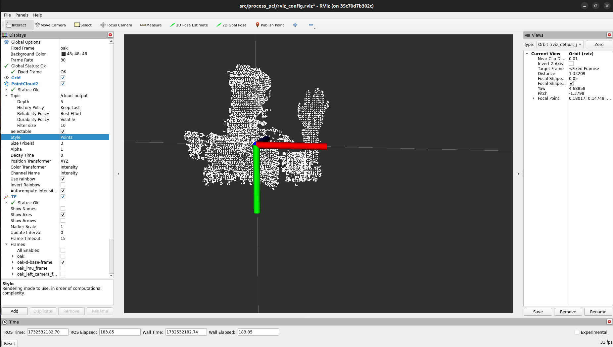

# ROS 2 Workspace with C++-Node for PCL pre-processing

This repository contains parts of my code (with updated versions of dependencies) that I wrote for my bachelor thesis about gesture recognition a few years ago. The part that can be found here contains the functionality of recieving, processing and publishing Pointclouds using a C++ ROS Node. For Message passing ROS 2 (Humble) is used and for PointCloud processing PCL (C++).


The code is packaged inside a [devcontainer](.devcontainer/devcontainer.json), which allows to directly work inside a docker container (via VSCode) where the program is running. In order to work, the directory containing the [.devcontainer](./.devcontainer/)-folder has to be opened with Visual Studio Code.

To build and open the container you have to use:
- Use this `[Ctrl] + [Shift] + [P]` to open the relevant menu in VSCode
- Choose `Dev container: Reopen in container`

Requirements:
- OAK-D Lite 3D camera by Luxonis ([Link](https://docs.luxonis.com/hardware/products/OAK-D%20Lite))
- ROS 2 (Humble)

## Building and Running the application
When everything is done, you will enter the built container:

```bash
# Install depthai-ros from source
cd /ros2_ws/src
git clone https://github.com/luxonis/depthai-ros.git
cd /ros2_ws

# Build everything
colcon build 

# If problem with install-folder, remove and rebuild binaries
rm -rf /ros2_ws/install
colcon build

# Update ros2 to make it find the installed packages
source install/setup.bash
```

Build the ROS 2 C++ package for PointCloud processing (if changes are made):
```bash
cd /ros2_ws
# Building the ros package
colcon build --packages-select process_pcl
# Making it available in current console session
source install/setup.bash
```

Launch the camera topic for the OAK-D Lite that publishes pointclouds:
```bash
ros2 launch depthai_ros_driver pointcloud.launch.py
```

Build the ROS package:
```bash
colcon build --packages-select process_pcl
```

Run the `data_processing`-Node for PointCloud-processing in the `process_pcl` ROS-package with this command:
```bash
ros2 run process_pcl data_processing
```

Open RViz2 to see the results:
```bash
# In ros2_ws
rviz2 --display-config src/process_pcl/rviz_config.rviz 
```

When everything is running you will be able to see results like this:

